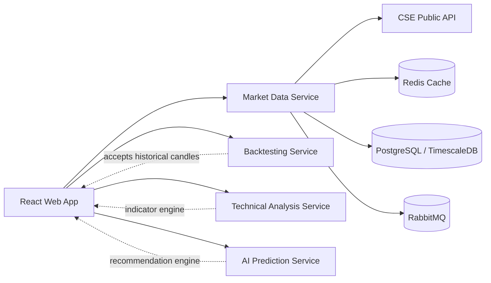

# CSE AI Trading Assistant Documentation

## 1. Overview

`CSE AI Trading Assistant` is a multi-service Colombo Stock Exchange trading intelligence platform that combines live market data, offline-capable local storage, portfolio management, alerts, watchlists, trade ideas, profit simulation, AI-assisted stock analysis, and strategy backtesting.

This documentation is synchronized with the current application implementation in the repository.

Current repository layers:

- React + TypeScript web application
- Node.js + Express market-data and user-data service
- Python FastAPI technical analysis service
- Python FastAPI AI recommendation service
- Python FastAPI backtesting service
- PostgreSQL / TimescaleDB-oriented schema
- Redis cache layer
- RabbitMQ event bus
- Docker Compose local runtime
- Kubernetes deployment scaffolding
- GitHub Actions CI pipeline

## 2. Product Scope

### 2.1 Product Features

- Executive dashboard
- Live full market watch
- Live quote lookup with fallback sources
- Stock analysis with company autocomplete
- AI recommendation and trade planning
- Live technical indicators in Stock Analysis
- Gemini trading copilot in Stock Analysis
- Paper broker execution with order preview and holdings sync
- Custom external broker account linking and provider-ready execution flow
- Profit simulator
- Backtesting Strategy Lab
- Auto Simulation for backtesting parameter search
- Saved backtest run history
- Persistent watchlists
- Persistent alerts
- Live alert evaluation and delivery logs for Email / SMS / Push workflows
- Persistent portfolio holdings and investor metrics
- Portfolio AI copilot with multi-stock orchestration
- Risk monitoring
- Login, registration, and profile management
- Role-aware authentication with admin/analyst/trader controls
- Audit logging for critical user and trading actions
- Protected premium routes for signed-in users
- English, Sinhala, and Tamil localization
- Live News & Sentiment ingestion with sentiment scoring, extracted symbols, and keywords
- Offline-capable market watch, quote, and history fallback

### 2.2 Platform and Delivery

- Kubernetes manifests now include config, secrets template, probes, resources, ingress, and autoscaling definitions
- CI validates frontend, market-data-service, Python services, and backtesting tests

### 2.3 Remaining Higher-Order Enhancements

- External broker reconciliation and asynchronous fill-status sync after order placement
- Deeper transaction-level realized P/L accounting across portfolio lifecycle events
- Stateful production manifests for PostgreSQL / Redis / RabbitMQ in Kubernetes
- Extended portfolio journaling and AI workflow memory

## 3. High-Level Architecture



Core system pattern:

- Try live CSE source first
- Fallback to Redis cache
- Fallback to PostgreSQL stored data
- Persist useful market snapshots and history locally for offline continuity

## 4. Repository Structure

```text
TA/
  apps/web/                              Frontend application
  services/market-data-service/          Node.js API and persistence layer
  services/technical-analysis-service/   FastAPI technical indicators
  services/ai-prediction-service/        FastAPI recommendation engine
  services/backtesting-service/          FastAPI strategy simulation engine
  infra/db/schema.sql                    PostgreSQL / TimescaleDB schema
  shared/contracts/                      Shared contracts and event definitions
  docs/                                  Project documentation
  k8s/                                   Kubernetes manifests
  .github/workflows/ci.yml               CI pipeline
  docker-compose.yml                     Local runtime definition
```

## 5. Frontend Technology

- React 19
- TypeScript
- Material UI
- React Router
- React Query
- Redux Toolkit
- Recharts

Frontend entry points:

- `apps/web/src/main.tsx`
- `apps/web/src/App.tsx`
- `apps/web/src/app/AppShell.tsx`

## 6. Frontend Routes

### Public routes

- `/` -> Executive Dashboard
- `/market-watch` -> Full Market Watch
- `/news` -> News & Sentiment
- `/login` -> Login
- `/register` -> Registration

### Protected routes

The following pages remain visible in navigation, but require login when opened:

- `/suggestions` -> Trade Ideas
- `/watchlists` -> Watchlists
- `/stocks` -> Stock Analysis
- `/portfolio` -> Portfolio Command
- `/alerts` -> Alerts
- `/backtests` -> Backtesting Strategy Lab
- `/profit-simulator` -> Profit Simulator
- `/profile` -> Profile

## 7. Application Shell

The application shell provides:

- Responsive sidebar and mobile drawer navigation
- Top search bar with shortcut routing
- Language selector
- Notification shortcut
- Settings / profile area
- Auth-aware user actions
- Premium dark enterprise layout

Localization behavior:

- Supports English (`en`), Sinhala (`si`), Tamil (`ta`)
- Stores selected language locally
- Updates document language
- Formats numbers by locale

## 8. Frontend Features

### 8.1 Executive Dashboard

Behavior:

- Loads aggregated dashboard data from `GET /api/market/dashboard`
- Shows:
  - ASPI
  - S&P SL20
  - managed portfolio value
  - risk posture
  - sector leadership
  - liquidity / market action widgets
  - portfolio monitor
  - alert and stock drill-down shortcuts

### 8.2 Full Market Watch

Behavior:

- Loads full market watch from `GET /api/market/watch`
- Supports:
  - search
  - sort
  - price and turnover browsing
  - drill-down into stock analysis
- Uses live CSE data with cache/database fallback

### 8.3 Stock Analysis

Behavior:

- Supports company autocomplete using market watch
- Supports query-param driven symbol analysis
- Loads:
  - quote
  - recommendation
  - stored historical series
- Displays:
  - current price and price change
  - history chart
  - AI recommendation card
  - live technical indicator values from technical-analysis service
  - market snapshot metrics
  - signal matrix
  - indicator reference
  - AI Trade Plan
  - AI Position Planner
  - AI Profit Projection
  - AI Scenario Forecast
  - Gemini Trading Copilot guidance
  - paper broker order execution and preview

### 8.4 Trade Ideas

Behavior:

- Uses `GET /api/market/suggestions`
- Displays ranked buy/sell/hold ideas
- Shows:
  - confidence
  - reasoning
  - supporting facts
  - related news context

### 8.5 Watchlists

Behavior:

- Persistent backend-backed watchlists
- Multiple watchlist support
- Add/remove symbols
- Delete watchlists
- Analyze selected symbols

### 8.6 Portfolio Command

Behavior:

- Persistent user portfolio backed by PostgreSQL
- Add/update/delete holdings
- Tracks:
  - symbol
  - name
  - sector
  - quantity
  - average cost
  - buy commission
  - sell commission rate
- Computes investor metrics:
  - cost basis
  - total invested
  - market value
  - estimated sell commission
  - estimated net proceeds
  - gross profit
  - net profit
  - gross return %
  - net return %
  - break-even price
  - weight %
- Shows sector allocation and portfolio insights
- Includes Portfolio AI Copilot:
  - add ideas
  - reduce ideas
  - rebalance actions
  - risk alerts
  - portfolio-level summary from holdings plus live news context

### 8.7 Risk Center

Behavior:

- Uses portfolio context to show risk posture
- Displays:
  - portfolio risk score
  - concentration insights
  - policy bars
  - risk warnings

### 8.8 Alerts

Behavior:

- Persistent alert CRUD
- Create, pause, resume, and delete alert rules
- Supports destination-aware Email / SMS / Push delivery configuration
- Can evaluate live alert rules on demand
- Stores recent alert delivery history with provider, destination, status, and message
- Supports alert types such as:
  - price breakout
  - RSI oversold / overbought
  - volume spike
  - AI buy / sell signal

### 8.9 News & Sentiment

Behavior:

- Live market news ingestion through RSS-backed feeds
- Search and filtering by source / sentiment
- Sentiment scoring for each article
- Extracted symbols and keyword tags
- Persisted news article records in PostgreSQL
- Shared live market news usage across News & Sentiment and Trade Ideas

### 8.10 Backtesting Strategy Lab

Behavior:

- Guided 4-step simulation builder
- Strategy presets:
  - Conservative
  - Balanced
  - Aggressive
- Supports:
  - company selection
  - history range
  - initial capital
  - position size
  - slippage
  - fee modes
  - SMA Crossover strategy
  - RSI Reversion strategy
- Displays:
  - profitability score
  - smart recommendations
  - best next actions
  - overview metrics
  - equity curve
  - trade table
  - CSV exports
- Includes `Auto Simulation`:
  - automatically tests multiple SMA/RSI parameter combinations
  - ranks results
  - applies best setup back into the lab
- Includes backtest history management:
  - save run
  - list saved runs
  - load saved runs
  - delete saved runs

### 8.11 Profit Simulator

Behavior:

- Fee-aware manual profit simulation tool
- Supports:
  - total capital
  - buy price
  - sell price
  - target profit
  - target return
  - fee mode
  - buy/sell fee %
  - lot size
- Computes:
  - shares
  - total buy cost
  - sell proceeds
  - net profit
  - break-even price
  - target sell price

### 8.12 Authentication and Profile

Behavior:

- Register with email/password
- Login with email/password
- First registered user becomes `ADMIN`
- JWT-based session restore
- Protected route handling with return-to-page flow
- Profile update for display name and preferred language
- Role-aware backend controls for admin and analyst-only endpoints
- Audit logging for registration, login, profile updates, portfolio updates, alerts, backtests, and broker actions

## 9. Backend Services

### 9.1 Market Data Service

Location:

- `services/market-data-service/`

Technology:

- Node.js
- Express
- TypeScript
- PostgreSQL client
- Redis client
- RabbitMQ client
- Zod validation

Responsibilities:

- Live CSE data proxy
- Dashboard aggregation
- Market watch API
- Quote API
- Recommendation API
- Historical price API
- Technical indicator API
- Stock copilot API
- Suggestions API
- RSS news aggregation for trade ideas
- Live news sentiment ingestion and persistence
- Auth API
- Watchlists API
- Alerts API
- Portfolio API
- Portfolio copilot API
- Broker account and execution API
- Admin RBAC and audit API
- Market persistence and cache fallback

Main implemented endpoint groups:

- `GET /health`
- `GET /api/market/dashboard`
- `GET /api/market/watch`
- `GET /api/market/suggestions`
- `GET /api/market/news`
- `GET /api/stocks/:symbol/quote`
- `GET /api/stocks/:symbol/recommendation`
- `GET /api/stocks/:symbol/history`
- `GET /api/stocks/:symbol/indicators`
- `POST /api/stocks/:symbol/copilot`
- `POST /api/auth/register`
- `POST /api/auth/login`
- `GET /api/auth/me`
- `PATCH /api/auth/me`
- `GET /api/watchlists`
- `POST /api/watchlists`
- `DELETE /api/watchlists/:id`
- `POST /api/watchlists/:id/items`
- `DELETE /api/watchlists/:id/items/:symbol`
- `GET /api/alerts`
- `POST /api/alerts`
- `PATCH /api/alerts/:id`
- `DELETE /api/alerts/:id`
- `GET /api/alerts/deliveries`
- `POST /api/alerts/evaluate`
- `GET /api/portfolio`
- `GET /api/portfolio/copilot`
- `PUT /api/portfolio/holdings`
- `DELETE /api/portfolio/holdings/:symbol`
- `GET /api/backtests`
- `POST /api/backtests`
- `DELETE /api/backtests/:id`
- `GET /api/broker/account`
- `POST /api/broker/account/link`
- `POST /api/broker/preview`
- `GET /api/broker/orders`
- `POST /api/broker/orders`
- `GET /api/admin/users`
- `PATCH /api/admin/users/:id/role`
- `GET /api/admin/audit-logs`

### 9.2 Offline Market Service Pattern

Implemented behavior:

- Live-first fetch from CSE
- Redis cache fallback
- PostgreSQL fallback
- Background market sync and persistence
- Stored quote reconstruction from database
- Stored historical series API

This is one of the most important implemented technical upgrades in the current codebase.

### 9.3 Technical Analysis Service

Location:

- `services/technical-analysis-service/`

Technology:

- Python
- FastAPI
- Pandas
- NumPy

Endpoints:

- `GET /health`
- `POST /indicators/compute`

Supported indicators:

- RSI
- MACD
- MACD signal
- MACD histogram
- EMA 12 / EMA 26
- SMA 20
- Bollinger Bands
- ATR 14
- VWAP
- Stochastic K / D

### 9.4 AI Prediction Service

Location:

- `services/ai-prediction-service/`

Technology:

- Python
- FastAPI
- Pandas
- NumPy

Endpoints:

- `GET /health`
- `POST /recommendations/generate`

Behavior:

- Uses explainable scoring based on RSI, MACD, and optional sector contribution
- Returns:
  - action
  - confidence
  - reasons
  - metrics

### 9.5 Backtesting Service

Location:

- `services/backtesting-service/`

Technology:

- Python
- FastAPI

Endpoints:

- `GET /health`
- `POST /backtests/run`

Capabilities:

- SMA crossover strategy
- RSI reversion strategy
- Fees
- Slippage
- Position sizing
- Equity curve generation
- Trade generation
- Profitability metrics

## 10. Data and Persistence

Schema file:

- `infra/db/schema.sql`

Main entities:

- `users`
- `stocks`
- `portfolios`
- `holdings`
- `transactions`
- `watchlists`
- `watchlist_items`
- `historical_prices`
- `indicators`
- `predictions`
- `alerts`
- `backtest_results`
- `company_financials`
- `announcements`
- `audit_logs`

Important current schema usage:

- `users` is used for auth and profile
- `stocks` stores quote-like market fields and sector information
- `holdings` stores user portfolio positions and commissions
- `watchlists` and `watchlist_items` are used by watchlist features
- `alerts` is used by persistent alert rules
- `historical_prices` stores market snapshots and analysis/backtesting series

TimescaleDB-oriented hypertables:

- `historical_prices`
- `indicators`

The schema is written to work gracefully even when local PostgreSQL does not support every Timescale feature.

## 11. Event-Driven Design

RabbitMQ is included for asynchronous communication.

Currently implemented:

- Market-data service publishes `market.snapshot.updated`

Planned extension points:

- alert trigger workflows
- technical indicator events
- prediction update events
- reporting jobs
- portfolio update events

## 12. CSE Data and Fallback Flow

### Market watch flow

```text
Frontend Market Watch
  -> market-data-service /api/market/watch
  -> live CSE fetch
  -> if unavailable: Redis cache
  -> if unavailable: PostgreSQL stored market data
  -> frontend table
```

### Quote flow

```text
Stock Analysis
  -> market-data-service /api/stocks/:symbol/quote
  -> live company info
  -> if unavailable: Redis quote cache
  -> if unavailable: PostgreSQL stored quote
  -> frontend analysis UI
```

### Historical analysis flow

```text
Stock Analysis / Backtesting
  -> market-data-service /api/stocks/:symbol/history
  -> PostgreSQL historical_prices
  -> chart / strategy simulation
```

### Portfolio valuation flow

```text
Portfolio Page
  -> portfolio holdings from PostgreSQL
  -> quote map from market-data-service
  -> compute cost / fees / profit / allocation
  -> frontend investor dashboard
```

### Backtesting flow

```text
Backtesting Page
  -> historical series from market-data-service
  -> backtesting-service /backtests/run
  -> metrics + trades + equity curve
  -> profitability guidance + auto simulation
```

## 13. Deployment

### 13.1 Docker Compose

Runtime file:

- `docker-compose.yml`

Current local runtime services:

- `redis`
- `rabbitmq`
- `market-data-service`
- `technical-analysis-service`
- `ai-prediction-service`
- `backtesting-service`
- `web`

Important note:

- PostgreSQL is expected to run on the local machine and is no longer provisioned inside Docker Compose in the current setup

Typical local ports:

- Web: `5174`
- Market Data Service: `8081`
- Technical Analysis Service: `8091`
- AI Prediction Service: `8092`
- Backtesting Service: `8093`
- Redis: `6379`
- RabbitMQ: `5672`
- RabbitMQ Management: `15672`
- PostgreSQL: local instance on `5432`

Start command:

```bash
cd /Users/ravendra/dev/TradingAssistant/TA
docker compose up --build
```

### 13.2 Kubernetes

Manifest directory:

- `k8s/`

Current manifests:

- `namespace.yaml`
- `market-data-service.yaml`
- `python-services.yaml`
- `web.yaml`

Current Kubernetes status:

- deployment/service manifests for web and APIs
- config-driven environment management via ConfigMap
- secrets template for sensitive runtime values
- readiness and liveness probes
- resource requests and limits
- ingress manifest
- HPA manifests for key services
- placeholder images still need replacement for real deployment targets

### 13.3 CI

Workflow:

- `.github/workflows/ci.yml`

Current CI validates:

- frontend install and build
- market-data-service install and build
- Python service compile checks
- backtesting unit tests

## 14. Technology Stack Summary

### Frontend

- React 19
- TypeScript
- Material UI
- React Router
- React Query
- Redux Toolkit
- Recharts

### Node backend

- Node.js
- Express
- TypeScript
- Zod
- pg
- redis
- amqplib
- bcryptjs
- jsonwebtoken

### Python services

- FastAPI
- Pandas
- NumPy

### Data / infra

- PostgreSQL
- TimescaleDB-oriented schema
- Redis
- RabbitMQ
- Docker Compose
- Kubernetes
- GitHub Actions

## 15. Current AI and Quant Features

Implemented AI / quant-related capabilities:

- explainable recommendation scoring
- technical indicators
- Gemini trading copilot
- AI trade plan in stock analysis
- AI position planner
- AI scenario forecast
- portfolio AI copilot
- profit simulator
- backtesting profitability scoring
- backtesting smart recommendations
- backtesting auto simulation
- saved backtest research history
- live news sentiment scoring and symbol extraction

LLM status:

- Gemini provider is integrated into runtime-aware copilot generation
- copilot includes fallback behavior when external LLM response is unavailable

## 16. Known Gaps and Next Priorities

Highest-value next implementation steps:

1. Add asynchronous external broker reconciliation and webhook/fill sync
2. Add deeper portfolio accounting using transaction-level realized P/L
3. Add Kubernetes stateful dependency manifests and production secret management
4. Expand alert scheduling into background workers and retry queues
5. Extend AI copilot with journal workflows and adaptive learning from user actions

## 17. Quick Reference

### Key frontend pages

- Dashboard
- Full Market Watch
- Trade Ideas
- Watchlists
- Stock Analysis
- Portfolio Command
- Risk Center
- Alerts
- News & Sentiment
- Backtesting Strategy Lab
- Profit Simulator
- Login / Register / Profile

### Key backend endpoints

- `GET /api/market/dashboard`
- `GET /api/market/watch`
- `GET /api/market/suggestions`
- `GET /api/market/news`
- `GET /api/stocks/:symbol/quote`
- `GET /api/stocks/:symbol/recommendation`
- `GET /api/stocks/:symbol/history`
- `GET /api/stocks/:symbol/indicators`
- `POST /api/stocks/:symbol/copilot`
- `POST /api/auth/register`
- `POST /api/auth/login`
- `GET /api/auth/me`
- `PATCH /api/auth/me`
- `GET /api/watchlists`
- `POST /api/watchlists`
- `GET /api/alerts`
- `POST /api/alerts`
- `GET /api/alerts/deliveries`
- `POST /api/alerts/evaluate`
- `GET /api/portfolio`
- `GET /api/portfolio/copilot`
- `PUT /api/portfolio/holdings`
- `GET /api/backtests`
- `POST /api/backtests`
- `GET /api/broker/account`
- `POST /api/broker/account/link`
- `POST /api/broker/preview`
- `POST /api/broker/orders`
- `GET /api/admin/users`
- `GET /api/admin/audit-logs`
- `POST /backtests/run`
- `POST /indicators/compute`
- `POST /recommendations/generate`

### Health endpoints

- `GET /health` on each backend service

## 18. Summary

The current codebase is no longer just a UI scaffold. It is now a working multi-service CSE trading platform foundation with:

- live and offline-capable market data
- persistent user accounts
- persistent watchlists
- live alert evaluation and delivery logs
- persistent portfolio holdings
- AI-assisted stock and portfolio analysis
- investor-grade profit and fee calculations
- profit simulator
- advanced backtesting with auto simulation and saved history
- live news ingestion with sentiment scoring
- provider-ready broker execution with paper and custom external account support
- RBAC and audit-backed operational controls
- multilingual enterprise UI

The platform is best described as an actively implemented production-oriented foundation with several real working modules already connected end to end, and several advanced enterprise extensions still open for the next development phase.
