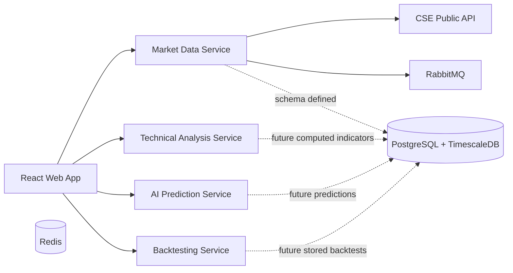

# CSE AI Trading Assistant Documentation

## 1. Overview

`CSE AI Trading Assistant` is a multi-service web platform for market intelligence, stock analysis, AI-assisted recommendations, backtesting, portfolio monitoring, risk visibility, alerts, and multilingual news sentiment review for the Colombo Stock Exchange.

This repository currently contains:

- A React + TypeScript frontend
- A Node.js market-data service
- A Python technical-analysis service
- A Python AI recommendation service
- A Python backtesting service
- PostgreSQL + TimescaleDB schema definitions
- Redis and RabbitMQ runtime infrastructure
- Docker Compose and Kubernetes deployment scaffolding
- CI workflow for build and validation

This document describes the implemented system behavior in the current codebase and highlights where scaffolding exists for future production depth.

## 2. Current Product Scope

### Implemented in the codebase

- Executive dashboard
- Full market watch backed by live CSE `tradeSummary`
- Stock analysis page with company autocomplete
- Live company quote lookup
- Rule-based explainable recommendation endpoint
- Technical indicator computation service
- SMA crossover backtesting service
- Portfolio monitoring UI
- Risk monitoring UI
- Alerts management UI
- News and sentiment UI with multilingual content switching
- English, Sinhala, and Tamil UI localization support
- Docker and Kubernetes deployment assets

### Present but not yet fully production-complete

- Local database persistence for the full market watch flow
- Historical market ingestion pipeline into TimescaleDB
- End-to-end portfolio persistence against PostgreSQL
- Real alert delivery workflows for email, SMS, and push
- Real news ingestion and LLM-driven sentiment pipeline
- AWS Cognito authentication and RBAC enforcement in runtime
- Reporting service implementation
- Full broker integration
- Automated model training and model registry lifecycle

## 3. High-Level Architecture



## 4. Repository Structure

```F#
TA/
  apps/web/                         Frontend application
  services/market-data-service/     Node.js CSE data proxy and market APIs
  services/technical-analysis-service/  FastAPI technical indicators
  services/ai-prediction-service/   FastAPI recommendation engine
  services/backtesting-service/     FastAPI backtesting engine
  infra/db/schema.sql               PostgreSQL + TimescaleDB schema
  k8s/                              Kubernetes manifests
  .github/workflows/ci.yml          CI pipeline
  docker-compose.yml                Local multi-service runtime
  shared/contracts/                 Shared domain contracts
  docs/                             Project documentation
```

## 5. Frontend Architecture

### Technology

- React 19
- TypeScript
- Material UI
- Redux Toolkit
- React Query
- Recharts

### Frontend entry points

- `apps/web/src/main.tsx`
- `apps/web/src/App.tsx`
- `apps/web/src/app/AppShell.tsx`

### Routing

The frontend currently exposes these application routes:

- `/` -> Executive Dashboard
- `/market-watch` -> Full Market Watch
- `/stocks` -> Stock Analysis
- `/portfolio` -> Portfolio Command
- `/risk` -> Risk Center
- `/alerts` -> Alert Operations Center
- `/news` -> News and Sentiment Intelligence
- `/backtests` -> Backtesting Strategy Lab

### App shell behavior

The application shell provides:

- Responsive left navigation
- Fixed desktop sidebar
- Mobile drawer navigation
- Top search bar
- Search routing shortcuts
- Language selector for `en`, `si`, and `ta`
- Notification shortcut to alerts
- Settings quick-navigation menu
- Shared premium workspace header

### Localization behavior

Localization is handled by `apps/web/src/i18n/I18nProvider.tsx`.

Current behavior:

- Stores the selected language in local storage
- Sets the HTML document language
- Provides translation lookup for shared labels and page copy
- Supports English, Sinhala, and Tamil
- Formats numbers according to the selected locale

## 6. Frontend Feature and Component Behavior

### 6.1 Executive Dashboard

File:

- `apps/web/src/pages/DashboardPage.tsx`

Behavior:

- Loads market snapshot from `GET /api/market/dashboard`
- Displays:
  - ASPI
  - S\&P SL20
  - portfolio value
  - risk posture
  - sector leadership
  - execution and exposure timeline
  - priority trading signals
  - sector allocation
  - liquidity view
  - portfolio monitor
  - news and sentiment radar
- `Create Trading Alert` routes to alert creation flow
- Review actions route to symbol-specific stock analysis

### 6.2 Full Market Watch

File:

- `apps/web/src/pages/MarketWatchPage.tsx`

Behavior:

- Uses live CSE `tradeSummary` data through the market-data service
- Shows a searchable market-wide table
- Supports:
  - symbol/company search
  - sorting
  - direction selection
  - drill-down to stock analysis
- Displays advancers and decliners summary chips

### 6.3 Stock Analysis

File:

- `apps/web/src/pages/StockAnalysisPage.tsx`

Behavior:

- Accepts route query parameter `symbol`
- Provides company autocomplete using the full market-watch feed
- Supports company name and symbol lookup
- Loads:
  - stock quote from market-data service
  - recommendation from stock API
- Displays:
  - company header
  - last traded price
  - price change
  - synthetic price visualization based on current quote
  - AI recommendation and confidence
  - market snapshot metrics
  - signal matrix
  - indicator explanations

Note:

- The chart is currently a visualization based on current quote context, not a fully persisted historical OHLC series from TimescaleDB.

### 6.4 Portfolio Command

File:

- `apps/web/src/pages/PortfolioPage.tsx`

Behavior:

- Uses current mock portfolio data from `enterpriseMock.ts`
- Displays:
  - holdings table
  - sector allocation pie chart
  - total managed value

Note:

- This is currently a UI-level operational surface and is not yet backed by persisted user portfolios from PostgreSQL.

### 6.5 Risk Center

File:

- `apps/web/src/pages/RiskPage.tsx`

Behavior:

- Calculates display metrics from portfolio mock data
- Shows:
  - portfolio risk score
  - largest position exposure
  - max sector exposure
  - policy progress bars
  - advisory alerts

### 6.6 Alerts

File:

- `apps/web/src/pages/AlertsPage.tsx`

Behavior:

- Displays existing alert rules
- Supports local UI creation of a new alert rule
- Supports toggling alert status between active and paused
- Supports channel selection:
  - email
  - SMS
  - push notification

Note:

- Current implementation is UI-local state and not yet connected to persistent backend alert storage or message delivery.

### 6.7 News and Sentiment

File:

- `apps/web/src/pages/NewsSentimentPage.tsx`

Behavior:

- Displays multilingual news/sentiment items
- Supports:
  - search
  - source filter
  - sentiment filter
  - reset
  - open-source external links
- News headline and summary change with the selected UI language

Note:

- Current content comes from local mock data with localized fields.
- Real-time ingestion from CSE news, announcements, or LLM sentiment processing is not yet connected.

### 6.8 Backtesting Strategy Lab

File:

- `apps/web/src/pages/BacktestPage.tsx`

Behavior:

- Accepts:
  - stock symbol
  - initial capital
  - fast SMA period
  - slow SMA period
- Calls the backtesting service
- Displays:
  - total return
  - win rate
  - profit factor
  - max drawdown
  - equity curve
  - strategy summary

## 7. Backend Services

## 7.1 Market Data Service

Location:

- `services/market-data-service/`

Technology:

- Node.js
- Express
- TypeScript

Current responsibilities:

- Acts as the live CSE data proxy
- Provides dashboard APIs
- Provides quote and recommendation APIs
- Provides full market watch API
- Publishes market snapshot events to RabbitMQ

### Implemented endpoints

- `GET /health`
- `GET /api/market/dashboard`
- `GET /api/market/watch`
- `GET /api/stocks/:symbol/quote`
- `GET /api/stocks/:symbol/recommendation`

### Current data behavior

- Pulls live market data directly from `https://www.cse.lk/api/`
- Does not yet persist the market watch flow to PostgreSQL
- Publishes `market.snapshot.updated` events to RabbitMQ

### Upstream CSE endpoints currently used

- `marketStatus`
- `marketSummery`
- `aspiData`
- `snpData`
- `topGainers`
- `topLooses`
- `mostActiveTrades`
- `allSectors`
- `chartData`
- `companyInfoSummery`
- `tradeSummary`

## 7.2 Technical Analysis Service

Location:

- `services/technical-analysis-service/`

Technology:

- Python
- FastAPI
- Pandas
- NumPy

Implemented endpoints:

- `GET /health`
- `POST /indicators/compute`

Supported indicators:

- RSI (14)
- MACD
- MACD signal
- MACD histogram
- EMA 12
- EMA 26
- SMA 20
- Bollinger Bands
- ATR 14
- VWAP
- Stochastic K
- Stochastic D

Behavior:

- Accepts candle arrays
- Computes the latest values
- Returns a structured response plus indicator explanations

## 7.3 AI Prediction Service

Location:

- `services/ai-prediction-service/`

Technology:

- Python
- FastAPI
- Pandas
- NumPy

Implemented endpoints:

- `GET /health`
- `POST /recommendations/generate`

Behavior:

- Accepts candles plus optional sector performance
- Computes indicator-derived scores
- Produces:
  - `BUY`
  - `SELL`
  - `HOLD`
- Returns:
  - confidence
  - reasons
  - metrics

Current logic:

- Explainable rules based on RSI, MACD, and sector contribution
- Designed as an inference API, not a full production model-serving platform yet

## 7.4 Backtesting Service

Location:

- `services/backtesting-service/`

Technology:

- Python
- FastAPI

Implemented endpoints:

- `GET /health`
- `POST /backtests/run`

Behavior:

- Runs SMA crossover backtests
- Accepts:
  - stock symbol
  - initial capital
  - fast period
  - slow period
  - candles
- Returns:
  - backtest metrics
  - trades
  - equity curve
  - strategy metadata

## 8. Event-Driven Design

RabbitMQ is included for event-driven communication.

Current implemented behavior:

- Market-data service publishes `market.snapshot.updated`

Planned extension points:

- technical analysis updates
- prediction generation events
- alert trigger events
- reporting events
- portfolio update events

## 9. Database Architecture

Schema file:

- `infra/db/schema.sql`

### PostgreSQL / TimescaleDB entities

- `users`
- `stocks`
- `portfolios`
- `holdings`
- `transactions`
- `watchlists`
- `watchlist_items`
- `historical_prices`
- `indicators`
- `predictions`
- `alerts`
- `backtest_results`
- `company_financials`
- `announcements`
- `audit_logs`

### TimescaleDB hypertables

- `historical_prices`
- `indicators`

### Enum types

- `user_role`
  - `ADMIN`
  - `TRADER`
  - `ANALYST`
- `alert_channel`
  - `EMAIL`
  - `SMS`
  - `PUSH`
- `alert_type`
  - `PRICE_BREAKOUT`
  - `RSI_OVERSOLD`
  - `RSI_OVERBOUGHT`
  - `VOLUME_SPIKE`
  - `AI_BUY_SIGNAL`
  - `AI_SELL_SIGNAL`
- `recommendation_action`
  - `BUY`
  - `SELL`
  - `HOLD`

### Current state of DB usage

- Schema is production-oriented and created during local DB bootstrap
- The schema is not yet fully wired to all frontend and backend flows
- Full market data ingestion to DB is still a next-stage implementation

## 10. Data Flow

### Dashboard flow

```text
Frontend Dashboard
  -> market-data-service /api/market/dashboard
  -> CSE public API
  -> aggregated response
  -> frontend charts/cards
```

### Stock analysis flow

```text
Stock Analysis Page
  -> market-data-service /api/market/watch        (autocomplete source)
  -> market-data-service /api/stocks/:symbol/quote
  -> market-data-service /api/stocks/:symbol/recommendation
  -> frontend visualization and decision UI
```

### Backtesting flow

```text
Backtesting Page
  -> backtesting-service /backtests/run
  -> SMA crossover engine
  -> metrics + equity curve
  -> frontend research view
```

### Indicator flow

```text
Client or future orchestrator
  -> technical-analysis-service /indicators/compute
  -> computed indicator package
```

### AI recommendation flow

```text
Client or future orchestrator
  -> ai-prediction-service /recommendations/generate
  -> explainable recommendation package
```

## 11. Deployment

## 11.1 Local Docker Compose

Primary runtime definition:

- `docker-compose.yml`

### Services started locally

- `db`
- `redis`
- `rabbitmq`
- `market-data-service`
- `technical-analysis-service`
- `ai-prediction-service`
- `backtesting-service`
- `web`

### Local ports

- Web: `5174` by default
- Market Data Service: `8081`
- Technical Analysis Service: `8091`
- AI Prediction Service: `8092`
- Backtesting Service: `8093`
- PostgreSQL: `5432`
- Redis: `6379`
- RabbitMQ: `5672`
- RabbitMQ Management UI: `15672`

### Start command

```bash
cd /Users/ravendra/dev/TradingAssistant/TA
docker compose up --build
```

## 11.2 Kubernetes

Manifest directory:

- `k8s/`

Current manifests:

- `namespace.yaml`
- `market-data-service.yaml`
- `python-services.yaml`
- `web.yaml`

Current Kubernetes state:

- Namespaced under `cse-ai`
- Uses image placeholders for deployment targets
- Provides basic deployment/service resources
- Does not yet include:
  - ingress
  - secrets
  - persistent volumes
  - readiness/liveness probes
  - production-grade autoscaling

## 11.3 CI

Workflow:

- `.github/workflows/ci.yml`

Current pipeline validates:

- frontend install and build
- market-data-service install and build
- Python service compile checks
- backtesting unit tests

## 11.4 Production Deployment Considerations

Recommended target stack:

- AWS EKS
- Amazon ECR
- RDS PostgreSQL / Timescale-compatible setup
- ElastiCache Redis
- RabbitMQ or managed messaging
- AWS Cognito
- ALB Ingress
- CloudWatch / centralized observability

Production hardening still needed:

- secrets management
- TLS
- ingress routing
- persistent DB storage
- RBAC enforcement
- observability dashboards
- scheduled ingestion jobs
- retry/circuit-breaker strategy for upstream CSE failures

## 12. Component Behavior Summary

### Shared behavior patterns

- React Query is used for API-driven pages
- Search and route-driven navigation are centralized in the shell
- Charts are rendered with Recharts
- Material UI provides layout and theming
- Localized text is resolved through `I18nProvider`

### UI state characteristics

- Alerts and some analytical views still use local or mock state
- Dashboard and market watch use live upstream-backed data
- Stock analysis combines live lookup with derived UI visualization
- News content is multilingual but currently mock-backed

## 13. Known Gaps and Next Implementation Priorities

The highest-value next engineering steps are:

1. Full market ingestion from CSE into PostgreSQL/TimescaleDB
2. Historical OHLC and company chart APIs backed by local storage
3. Persistent user portfolio and alerts services
4. Real news/announcement ingestion and sentiment pipeline
5. Authentication, authorization, and audit enforcement
6. Production-grade deployment hardening

## 14. Quick Reference

### Frontend pages

- Dashboard
- Full Market Watch
- Stock Analysis
- Portfolio Command
- Risk Center
- Alerts
- News & Sentiment
- Backtesting

### Core backend endpoints

- `GET /api/market/dashboard`
- `GET /api/market/watch`
- `GET /api/stocks/:symbol/quote`
- `GET /api/stocks/:symbol/recommendation`
- `POST /indicators/compute`
- `POST /recommendations/generate`
- `POST /backtests/run`

### Health endpoints

- `GET /health` on each backend service

## 15. Summary

This repository already provides a strong multi-service foundation for a Colombo Stock Exchange intelligence platform:

- live market snapshot
- full market watch
- stock drill-down
- explainable recommendation flow
- technical indicators
- backtesting
- multilingual UI surfaces
- deployment scaffolding

The current codebase is best described as a production-structured platform foundation with several live working features and several deeper data-persistence and orchestration layers still pending for full production completion.
